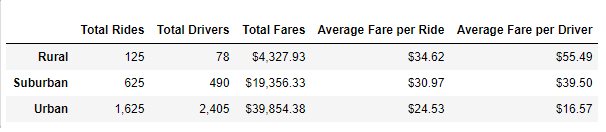

# PyBer Analysis

## Overview of the analysis
This analysis uses data from the Pyber ride-sharing company to create a summary DataFrame of the ride-sharing data by city type, and a multiple-line graph that shows the total weekly fares for each city type. 

## Results

From the table above, we can conclude that:
- Rural type has the least rides and drivers, however, the average fare is the highest.
- Urban type has the most rides and drivers, with the least average fare.
- Suburban is between rural and urban in total rides, drivers, and average fare.

The line plot above takes data for dates from '2019-01-01' to '2019-04-29' by week, as a supplement of the conclusion we got above.

## Summary
Based on the analysis, these are some recommendations:
- The number of drivers in rural and suburban cities can be increased as there were more rides than drivers, also decrease the number of drivers in urban cites for similar reason.
- The average fare in urban cities is low. We can give discount based on travel distance to encourage long trips.
- We can modify the number of drivers based on dates. For example, there is more demand on holidays.
